Data Analysis and Visualisation
================
Johnathan Evanilla
10/28/2024

First, we’ll need to load some packages.

R comes with lots of great tools out of the box, but there are others
that people develop for specific tasks.

# Reading files with data

Set your path to the “Qry_Phytoplankton Total Cell_L DATA.XLSX”
spreadsheet in quotes below:

``` r
my_path <- file.path("~/Documents/Bigelow/data/Qry_Phytoplankton Total Cell_L DATA.XLSX")
```

The package `readxl` provides tools for reading excel files (ie .xls and
.xlsx)

``` r
x <- read_excel(path = my_path)

x
```

    ## # A tibble: 16,459 × 9
    ##    `Date Collected`    Station           Depth   Specie      `Microscope fields`
    ##    <dttm>              <chr>             <chr>   <chr>                     <dbl>
    ##  1 2022-02-07 00:00:00 Production Area 2 surface Stephanopy…                   2
    ##  2 2022-02-07 00:00:00 Production Area 2 surface Striatella…                   2
    ##  3 2022-02-07 00:00:00 Production Area 2 surface Synedra sp                    2
    ##  4 2022-02-07 00:00:00 Production Area 2 surface Thalassios…                   2
    ##  5 2022-02-07 00:00:00 Production Area 2 surface Actinocycl…                   2
    ##  6 2022-02-07 00:00:00 Production Area 2 surface Alexandriu…                   2
    ##  7 2022-02-07 00:00:00 Production Area 2 surface Cylindroth…                   2
    ##  8 2022-02-07 00:00:00 Production Area 2 surface Diplopsali…                   2
    ##  9 2022-02-07 00:00:00 Production Area 2 surface Gymnodiniu…                   2
    ## 10 2022-02-07 00:00:00 Production Area 2 surface Navicula s…                   2
    ## # ℹ 16,449 more rows
    ## # ℹ 4 more variables: `SumOfTransect Count` <dbl>, `Cells/L` <dbl>,
    ## #   Groups <chr>, `Toxin producing species` <chr>

The `readr` package also has functions for reading other file types
like:

`read_csv()` - comma separated `read_tsv()` - tab separated

These files can be stored locally on you computer or hosted at a url
like <https://>

## Inspecting data.frame objects

We already saw how the functions head() and str() can be useful to check
the content and the structure of a data.frame. Here is a non-exhaustive
list of functions to get a sense of the content/structure of the data.

### Size:

- `dim()` - returns a vector with the number of rows in the first
  element, and the number of columns as the second element (the
  dimensions of the object)
- `nrow()` - returns the number of rows
- `ncol()` - returns the number of columns

``` r
dim(x)
```

    ## [1] 16459     9

``` r
nrow(x)
```

    ## [1] 16459

``` r
ncol(x)
```

    ## [1] 9

### Content:

- `head()` - shows the first 6 rows
- `tail()` - shows the last 6 rows

``` r
head(x, 10)
```

    ## # A tibble: 10 × 9
    ##    `Date Collected`    Station           Depth   Specie      `Microscope fields`
    ##    <dttm>              <chr>             <chr>   <chr>                     <dbl>
    ##  1 2022-02-07 00:00:00 Production Area 2 surface Stephanopy…                   2
    ##  2 2022-02-07 00:00:00 Production Area 2 surface Striatella…                   2
    ##  3 2022-02-07 00:00:00 Production Area 2 surface Synedra sp                    2
    ##  4 2022-02-07 00:00:00 Production Area 2 surface Thalassios…                   2
    ##  5 2022-02-07 00:00:00 Production Area 2 surface Actinocycl…                   2
    ##  6 2022-02-07 00:00:00 Production Area 2 surface Alexandriu…                   2
    ##  7 2022-02-07 00:00:00 Production Area 2 surface Cylindroth…                   2
    ##  8 2022-02-07 00:00:00 Production Area 2 surface Diplopsali…                   2
    ##  9 2022-02-07 00:00:00 Production Area 2 surface Gymnodiniu…                   2
    ## 10 2022-02-07 00:00:00 Production Area 2 surface Navicula s…                   2
    ## # ℹ 4 more variables: `SumOfTransect Count` <dbl>, `Cells/L` <dbl>,
    ## #   Groups <chr>, `Toxin producing species` <chr>

``` r
tail(x)
```

    ## # A tibble: 6 × 9
    ##   `Date Collected`    Station           Depth     Specie     `Microscope fields`
    ##   <dttm>              <chr>             <chr>     <chr>                    <dbl>
    ## 1 2018-01-08 00:00:00 Production Area 2 composite Prorocent…                   1
    ## 2 2018-01-08 00:00:00 Production Area 2 composite Prorocent…                   1
    ## 3 2018-01-08 00:00:00 Production Area 2 composite Prorocent…                   2
    ## 4 2018-01-08 00:00:00 Production Area 2 composite Protoperi…                   2
    ## 5 2018-01-08 00:00:00 Production Area 2 composite Scrippsie…                   2
    ## 6 2018-01-08 00:00:00 Production Area 2 composite Pleurosig…                   2
    ## # ℹ 4 more variables: `SumOfTransect Count` <dbl>, `Cells/L` <dbl>,
    ## #   Groups <chr>, `Toxin producing species` <chr>

### Names:

- `names()` - returns the column names (synonym of colnames() for
  data.frame objects)

``` r
names(x)
```

    ## [1] "Date Collected"          "Station"                
    ## [3] "Depth"                   "Specie"                 
    ## [5] "Microscope fields"       "SumOfTransect Count"    
    ## [7] "Cells/L"                 "Groups"                 
    ## [9] "Toxin producing species"

### Summary:

- `str()` - structure of the object and information about the class,
  length and content of each column
- `summary()` - summary statistics for every column in the data.frame
- `glimpse()` - similar to `str()` but shows you more rows of data
  across the screen; the table is transposed sideways

``` r
str(x)
```

    ## tibble [16,459 × 9] (S3: tbl_df/tbl/data.frame)
    ##  $ Date Collected         : POSIXct[1:16459], format: "2022-02-07" "2022-02-07" ...
    ##  $ Station                : chr [1:16459] "Production Area 2" "Production Area 2" "Production Area 2" "Production Area 2" ...
    ##  $ Depth                  : chr [1:16459] "surface" "surface" "surface" "surface" ...
    ##  $ Specie                 : chr [1:16459] "Stephanopyxis turris" "Striatella sp." "Synedra sp" "Thalassiosira sp." ...
    ##  $ Microscope fields      : num [1:16459] 2 2 2 2 2 2 2 2 2 2 ...
    ##  $ SumOfTransect Count    : num [1:16459] 2 1 29 6 2 2 118 1 13 113 ...
    ##  $ Cells/L                : num [1:16459] 371 186 5384 1114 371 ...
    ##  $ Groups                 : chr [1:16459] "Diatoms" "Diatom" "Diatoms" "Diatoms" ...
    ##  $ Toxin producing species: chr [1:16459] NA NA NA NA ...

``` r
summary(x)
```

    ##  Date Collected                     Station             Depth          
    ##  Min.   :2018-01-08 00:00:00.00   Length:16459       Length:16459      
    ##  1st Qu.:2018-11-07 00:00:00.00   Class :character   Class :character  
    ##  Median :2019-10-28 00:00:00.00   Mode  :character   Mode  :character  
    ##  Mean   :2020-01-17 01:47:52.51                                        
    ##  3rd Qu.:2021-04-13 00:00:00.00                                        
    ##  Max.   :2022-02-07 00:00:00.00                                        
    ##                                                                        
    ##     Specie          Microscope fields SumOfTransect Count    Cells/L         
    ##  Length:16459       Min.   : 1.000    Min.   :     0.0    Min.   :        0  
    ##  Class :character   1st Qu.: 2.000    1st Qu.:     2.0    1st Qu.:      371  
    ##  Mode  :character   Median : 2.000    Median :     5.0    Median :      928  
    ##                     Mean   : 2.058    Mean   :    95.9    Mean   :    17734  
    ##                     3rd Qu.: 2.000    3rd Qu.:    16.0    3rd Qu.:     2785  
    ##                     Max.   :20.000    Max.   :600000.0    Max.   :111383706  
    ##                                       NA's   :13          NA's   :96         
    ##     Groups          Toxin producing species
    ##  Length:16459       Length:16459           
    ##  Class :character   Class :character       
    ##  Mode  :character   Mode  :character       
    ##                                            
    ##                                            
    ##                                            
    ## 

`summary()` can also be called on a single column

``` r
summary(x$`Cells/L`)
```

    ##      Min.   1st Qu.    Median      Mean   3rd Qu.      Max.      NA's 
    ##         0       371       928     17734      2785 111383706        96

``` r
glimpse(x)
```

    ## Rows: 16,459
    ## Columns: 9
    ## $ `Date Collected`          <dttm> 2022-02-07, 2022-02-07, 2022-02-07, 2022-02…
    ## $ Station                   <chr> "Production Area 2", "Production Area 2", "P…
    ## $ Depth                     <chr> "surface", "surface", "surface", "surface", …
    ## $ Specie                    <chr> "Stephanopyxis turris", "Striatella sp.", "S…
    ## $ `Microscope fields`       <dbl> 2, 2, 2, 2, 2, 2, 2, 2, 2, 2, 2, 2, 1, 2, 2,…
    ## $ `SumOfTransect Count`     <dbl> 2, 1, 29, 6, 2, 2, 118, 1, 13, 113, 4, 4, 2,…
    ## $ `Cells/L`                 <dbl> 371.2790, 185.6395, 5383.5458, 1113.8371, 37…
    ## $ Groups                    <chr> "Diatoms", "Diatom", "Diatoms", "Diatoms", "…
    ## $ `Toxin producing species` <chr> NA, NA, NA, NA, NA, "PSP", NA, NA, NA, NA, N…

Note: most of these functions are “generic”, meaning they can be used on
other types of objects beyond a data.frame.

`View()` also allows you to open the data.frame in a new window to
explore by hand

## Working on data frames using dplyr

We can print the data.frame to look at by just calling its name

Notice that all of the columns don’t fit onto the page, but you can use
the right arrow to see the others

``` r
x
```

    ## # A tibble: 16,459 × 9
    ##    `Date Collected`    Station           Depth   Specie      `Microscope fields`
    ##    <dttm>              <chr>             <chr>   <chr>                     <dbl>
    ##  1 2022-02-07 00:00:00 Production Area 2 surface Stephanopy…                   2
    ##  2 2022-02-07 00:00:00 Production Area 2 surface Striatella…                   2
    ##  3 2022-02-07 00:00:00 Production Area 2 surface Synedra sp                    2
    ##  4 2022-02-07 00:00:00 Production Area 2 surface Thalassios…                   2
    ##  5 2022-02-07 00:00:00 Production Area 2 surface Actinocycl…                   2
    ##  6 2022-02-07 00:00:00 Production Area 2 surface Alexandriu…                   2
    ##  7 2022-02-07 00:00:00 Production Area 2 surface Cylindroth…                   2
    ##  8 2022-02-07 00:00:00 Production Area 2 surface Diplopsali…                   2
    ##  9 2022-02-07 00:00:00 Production Area 2 surface Gymnodiniu…                   2
    ## 10 2022-02-07 00:00:00 Production Area 2 surface Navicula s…                   2
    ## # ℹ 16,449 more rows
    ## # ℹ 4 more variables: `SumOfTransect Count` <dbl>, `Cells/L` <dbl>,
    ## #   Groups <chr>, `Toxin producing species` <chr>

### Subsetting columns

`select()` lets us subset specified columns

``` r
select(x, `Date Collected`, Station, Specie, `Cells/L`)
```

    ## # A tibble: 16,459 × 4
    ##    `Date Collected`    Station           Specie                   `Cells/L`
    ##    <dttm>              <chr>             <chr>                        <dbl>
    ##  1 2022-02-07 00:00:00 Production Area 2 Stephanopyxis turris          371.
    ##  2 2022-02-07 00:00:00 Production Area 2 Striatella sp.                186.
    ##  3 2022-02-07 00:00:00 Production Area 2 Synedra sp                   5384.
    ##  4 2022-02-07 00:00:00 Production Area 2 Thalassiosira sp.            1114.
    ##  5 2022-02-07 00:00:00 Production Area 2 Actinocyclus sp               371.
    ##  6 2022-02-07 00:00:00 Production Area 2 Alexandrium sp.               371.
    ##  7 2022-02-07 00:00:00 Production Area 2 Cylindrotheca closterium    21905.
    ##  8 2022-02-07 00:00:00 Production Area 2 Diplopsalis sp.               186.
    ##  9 2022-02-07 00:00:00 Production Area 2 Gymnodinium sp.              2413.
    ## 10 2022-02-07 00:00:00 Production Area 2 Navicula sp.                20977.
    ## # ℹ 16,449 more rows

The pipe operator `|>` passes the result of the content on its left as
the first argument to the function on its right

The code below yields the same result as the code just above

``` r
x |>
  select(`Date Collected`, Station, Specie, `Cells/L`)
```

    ## # A tibble: 16,459 × 4
    ##    `Date Collected`    Station           Specie                   `Cells/L`
    ##    <dttm>              <chr>             <chr>                        <dbl>
    ##  1 2022-02-07 00:00:00 Production Area 2 Stephanopyxis turris          371.
    ##  2 2022-02-07 00:00:00 Production Area 2 Striatella sp.                186.
    ##  3 2022-02-07 00:00:00 Production Area 2 Synedra sp                   5384.
    ##  4 2022-02-07 00:00:00 Production Area 2 Thalassiosira sp.            1114.
    ##  5 2022-02-07 00:00:00 Production Area 2 Actinocyclus sp               371.
    ##  6 2022-02-07 00:00:00 Production Area 2 Alexandrium sp.               371.
    ##  7 2022-02-07 00:00:00 Production Area 2 Cylindrotheca closterium    21905.
    ##  8 2022-02-07 00:00:00 Production Area 2 Diplopsalis sp.               186.
    ##  9 2022-02-07 00:00:00 Production Area 2 Gymnodinium sp.              2413.
    ## 10 2022-02-07 00:00:00 Production Area 2 Navicula sp.                20977.
    ## # ℹ 16,449 more rows

### Filtering values

`filter()` is for getting a subset of rows based on a condition

``` r
x |>
  mutate(Groups = tolower(Groups))
```

    ## # A tibble: 16,459 × 9
    ##    `Date Collected`    Station           Depth   Specie      `Microscope fields`
    ##    <dttm>              <chr>             <chr>   <chr>                     <dbl>
    ##  1 2022-02-07 00:00:00 Production Area 2 surface Stephanopy…                   2
    ##  2 2022-02-07 00:00:00 Production Area 2 surface Striatella…                   2
    ##  3 2022-02-07 00:00:00 Production Area 2 surface Synedra sp                    2
    ##  4 2022-02-07 00:00:00 Production Area 2 surface Thalassios…                   2
    ##  5 2022-02-07 00:00:00 Production Area 2 surface Actinocycl…                   2
    ##  6 2022-02-07 00:00:00 Production Area 2 surface Alexandriu…                   2
    ##  7 2022-02-07 00:00:00 Production Area 2 surface Cylindroth…                   2
    ##  8 2022-02-07 00:00:00 Production Area 2 surface Diplopsali…                   2
    ##  9 2022-02-07 00:00:00 Production Area 2 surface Gymnodiniu…                   2
    ## 10 2022-02-07 00:00:00 Production Area 2 surface Navicula s…                   2
    ## # ℹ 16,449 more rows
    ## # ℹ 4 more variables: `SumOfTransect Count` <dbl>, `Cells/L` <dbl>,
    ## #   Groups <chr>, `Toxin producing species` <chr>

``` r
x |>
  filter(`Cells/L` < 100)
```

    ## # A tibble: 204 × 9
    ##    `Date Collected`    Station           Depth     Specie    `Microscope fields`
    ##    <dttm>              <chr>             <chr>     <chr>                   <dbl>
    ##  1 2022-02-07 00:00:00 Production Area 2 surface   Prorocen…                   1
    ##  2 2022-02-07 00:00:00 Production Area 2 surface   Prorocen…                   1
    ##  3 2022-02-07 00:00:00 Production Area 2 surface   Prorocen…                   1
    ##  4 2022-02-07 00:00:00 Production Area 2 surface   Prorocen…                   1
    ##  5 2022-02-07 00:00:00 Production Area 2 surface   Prorocen…                   1
    ##  6 2022-02-07 00:00:00 Production Area 7 surface   Dinophys…                   1
    ##  7 2022-01-27 00:00:00 Production Area 3 composite Prorocen…                   1
    ##  8 2022-01-27 00:00:00 Production Area 3 composite Prorocen…                   1
    ##  9 2022-01-27 00:00:00 Production Area 3 surface   Prorocen…                   1
    ## 10 2022-01-24 00:00:00 Production Area 3 surface   Dinophys…                   1
    ## # ℹ 194 more rows
    ## # ℹ 4 more variables: `SumOfTransect Count` <dbl>, `Cells/L` <dbl>,
    ## #   Groups <chr>, `Toxin producing species` <chr>

The pipe operator is useful for chaining together operations on our
data.frame

``` r
x |> 
  select(`Date Collected`, Station, Specie, `Cells/L`) |>
  filter(`Cells/L` < 100)
```

    ## # A tibble: 204 × 4
    ##    `Date Collected`    Station           Specie               `Cells/L`
    ##    <dttm>              <chr>             <chr>                    <dbl>
    ##  1 2022-02-07 00:00:00 Production Area 2 Prorocentrum cf lima        80
    ##  2 2022-02-07 00:00:00 Production Area 2 Prorocentrum lima           80
    ##  3 2022-02-07 00:00:00 Production Area 2 Prorocentrum cf lima        80
    ##  4 2022-02-07 00:00:00 Production Area 2 Prorocentrum lima           80
    ##  5 2022-02-07 00:00:00 Production Area 2 Prorocentrum lima           80
    ##  6 2022-02-07 00:00:00 Production Area 7 Dinophysis acuminata        40
    ##  7 2022-01-27 00:00:00 Production Area 3 Prorocentrum lima           40
    ##  8 2022-01-27 00:00:00 Production Area 3 Prorocentrum lima           40
    ##  9 2022-01-27 00:00:00 Production Area 3 Prorocentrum lima           40
    ## 10 2022-01-24 00:00:00 Production Area 3 Dinophysis acuminata        40
    ## # ℹ 194 more rows

Subsetting by character string

``` r
x |>
  filter(Station == "Production Area 1")
```

    ## # A tibble: 2,749 × 9
    ##    `Date Collected`    Station           Depth     Specie    `Microscope fields`
    ##    <dttm>              <chr>             <chr>     <chr>                   <dbl>
    ##  1 2021-12-14 00:00:00 Production Area 1 composite Chaetoce…                   2
    ##  2 2021-12-14 00:00:00 Production Area 1 composite Gonyaula…                   2
    ##  3 2021-12-14 00:00:00 Production Area 1 composite Corethro…                   2
    ##  4 2021-12-14 00:00:00 Production Area 1 composite Dinophys…                   1
    ##  5 2021-12-14 00:00:00 Production Area 1 composite Dinophys…                   1
    ##  6 2021-12-14 00:00:00 Production Area 1 composite Dictyoch…                   2
    ##  7 2021-12-14 00:00:00 Production Area 1 composite Dactylio…                   2
    ##  8 2021-12-14 00:00:00 Production Area 1 composite Cylindro…                   2
    ##  9 2021-12-14 00:00:00 Production Area 1 composite Coscinod…                   2
    ## 10 2021-12-14 00:00:00 Production Area 1 composite Chaetoce…                   2
    ## # ℹ 2,739 more rows
    ## # ℹ 4 more variables: `SumOfTransect Count` <dbl>, `Cells/L` <dbl>,
    ## #   Groups <chr>, `Toxin producing species` <chr>

### Mutating new columns

`mutate()` - change or make new columns

``` r
x |>
  mutate(id = paste(`Date Collected`, Station, Specie, sep="_"))
```

    ## # A tibble: 16,459 × 10
    ##    `Date Collected`    Station           Depth   Specie      `Microscope fields`
    ##    <dttm>              <chr>             <chr>   <chr>                     <dbl>
    ##  1 2022-02-07 00:00:00 Production Area 2 surface Stephanopy…                   2
    ##  2 2022-02-07 00:00:00 Production Area 2 surface Striatella…                   2
    ##  3 2022-02-07 00:00:00 Production Area 2 surface Synedra sp                    2
    ##  4 2022-02-07 00:00:00 Production Area 2 surface Thalassios…                   2
    ##  5 2022-02-07 00:00:00 Production Area 2 surface Actinocycl…                   2
    ##  6 2022-02-07 00:00:00 Production Area 2 surface Alexandriu…                   2
    ##  7 2022-02-07 00:00:00 Production Area 2 surface Cylindroth…                   2
    ##  8 2022-02-07 00:00:00 Production Area 2 surface Diplopsali…                   2
    ##  9 2022-02-07 00:00:00 Production Area 2 surface Gymnodiniu…                   2
    ## 10 2022-02-07 00:00:00 Production Area 2 surface Navicula s…                   2
    ## # ℹ 16,449 more rows
    ## # ℹ 5 more variables: `SumOfTransect Count` <dbl>, `Cells/L` <dbl>,
    ## #   Groups <chr>, `Toxin producing species` <chr>, id <chr>

Let’s add a month and week column

``` r
x <- x |>
  mutate(month = format(`Date Collected`, format="%m"),
         week = format(`Date Collected`, format="%U"),
         year = format(`Date Collected`, format="%Y"))
```

`format()` is useful for modifying date formats

There are lot’s of format codes for dates in R.
[list](https://www.r-bloggers.com/2013/08/date-formats-in-r/) contains a
lot of them.

``` r
format(x$`Date Collected`[1], format="%b")
```

    ## [1] "Feb"

### Renaming columns

`rename()` will change the name of columns

Use the syntax `new_name = old_name` in the arguments

``` r
rename(x, date = `Date Collected`)
```

    ## # A tibble: 16,459 × 12
    ##    date                Station           Depth   Specie      `Microscope fields`
    ##    <dttm>              <chr>             <chr>   <chr>                     <dbl>
    ##  1 2022-02-07 00:00:00 Production Area 2 surface Stephanopy…                   2
    ##  2 2022-02-07 00:00:00 Production Area 2 surface Striatella…                   2
    ##  3 2022-02-07 00:00:00 Production Area 2 surface Synedra sp                    2
    ##  4 2022-02-07 00:00:00 Production Area 2 surface Thalassios…                   2
    ##  5 2022-02-07 00:00:00 Production Area 2 surface Actinocycl…                   2
    ##  6 2022-02-07 00:00:00 Production Area 2 surface Alexandriu…                   2
    ##  7 2022-02-07 00:00:00 Production Area 2 surface Cylindroth…                   2
    ##  8 2022-02-07 00:00:00 Production Area 2 surface Diplopsali…                   2
    ##  9 2022-02-07 00:00:00 Production Area 2 surface Gymnodiniu…                   2
    ## 10 2022-02-07 00:00:00 Production Area 2 surface Navicula s…                   2
    ## # ℹ 16,449 more rows
    ## # ℹ 7 more variables: `SumOfTransect Count` <dbl>, `Cells/L` <dbl>,
    ## #   Groups <chr>, `Toxin producing species` <chr>, month <chr>, week <chr>,
    ## #   year <chr>

### Ordering rows

`arrange()` updates the row order by a column

``` r
arrange(x, `Cells/L`)
```

    ## # A tibble: 16,459 × 12
    ##    `Date Collected`    Station           Depth     Specie    `Microscope fields`
    ##    <dttm>              <chr>             <chr>     <chr>                   <dbl>
    ##  1 2019-04-08 00:00:00 Production Area 1 composite Tintinni…                   2
    ##  2 2022-02-07 00:00:00 Production Area 7 surface   Dinophys…                   1
    ##  3 2022-01-27 00:00:00 Production Area 3 composite Prorocen…                   1
    ##  4 2022-01-27 00:00:00 Production Area 3 composite Prorocen…                   1
    ##  5 2022-01-27 00:00:00 Production Area 3 surface   Prorocen…                   1
    ##  6 2022-01-24 00:00:00 Production Area 3 surface   Dinophys…                   1
    ##  7 2022-01-24 00:00:00 Production Area 3 surface   Prorocen…                   1
    ##  8 2022-01-24 00:00:00 Production Area 3 surface   Dinophys…                   1
    ##  9 2022-01-17 00:00:00 Production Area 8 surface   Dinophys…                   1
    ## 10 2021-12-06 00:00:00 Production Area 3 surface   Dinophys…                   1
    ## # ℹ 16,449 more rows
    ## # ℹ 7 more variables: `SumOfTransect Count` <dbl>, `Cells/L` <dbl>,
    ## #   Groups <chr>, `Toxin producing species` <chr>, month <chr>, week <chr>,
    ## #   year <chr>

`desc()` will order rows based on descending order of the column

``` r
arrange(x, desc(`Cells/L`))
```

    ## # A tibble: 16,459 × 12
    ##    `Date Collected`    Station           Depth     Specie    `Microscope fields`
    ##    <dttm>              <chr>             <chr>     <chr>                   <dbl>
    ##  1 2018-12-12 00:00:00 Production Area 5 surface   "Heteros…                   2
    ##  2 2018-12-12 00:00:00 Production Area 5 surface   "Heteroc…                   2
    ##  3 2021-05-17 00:00:00 Production Area 2 surface   "Cylindr…                   2
    ##  4 2019-07-08 00:00:00 Production Area 1 composite "Asterio…                   2
    ##  5 2019-07-01 00:00:00 Production Area 1 composite "Chaetoc…                   2
    ##  6 2019-07-08 00:00:00 Production Area 1 composite "Chaetoc…                   2
    ##  7 2021-05-18 00:00:00 Production Area 1 composite "Cylindr…                   2
    ##  8 2019-11-11 00:00:00 Production Area 1 composite "Skeleto…                   2
    ##  9 2019-06-10 00:00:00 Production Area 1 composite "Skeleto…                   2
    ## 10 2019-03-18 00:00:00 Production Area 1 composite "Thalass…                   2
    ## # ℹ 16,449 more rows
    ## # ℹ 7 more variables: `SumOfTransect Count` <dbl>, `Cells/L` <dbl>,
    ## #   Groups <chr>, `Toxin producing species` <chr>, month <chr>, week <chr>,
    ## #   year <chr>

# *Alexandrium* data

``` r
al <- filter(x, Specie %in% c("Alexandrium sp.", "Alexandrium Tamarense", "Alexandrium acatenella", "Alexandrium catenella", "Alexandrium minutum", "alexandrium Tamarense"))
```

``` r
al
```

    ## # A tibble: 197 × 12
    ##    `Date Collected`    Station           Depth     Specie    `Microscope fields`
    ##    <dttm>              <chr>             <chr>     <chr>                   <dbl>
    ##  1 2022-02-07 00:00:00 Production Area 2 surface   Alexandr…                   2
    ##  2 2022-02-07 00:00:00 Production Area 2 surface   Alexandr…                   2
    ##  3 2022-02-07 00:00:00 Production Area 2 surface   Alexandr…                   2
    ##  4 2022-01-31 00:00:00 Production Area 2 surface   Alexandr…                   2
    ##  5 2022-01-24 00:00:00 Production Area 2 surface   Alexandr…                   2
    ##  6 2022-01-17 00:00:00 Production Area 2 composite Alexandr…                   2
    ##  7 2021-12-28 00:00:00 Production Area 2 composite Alexandr…                   2
    ##  8 2021-09-27 00:00:00 Production Area 2 surface   Alexandr…                   2
    ##  9 2021-09-20 00:00:00 Production Area 2 surface   Alexandr…                   2
    ## 10 2021-09-06 00:00:00 Production Area 2 surface   Alexandr…                   2
    ## # ℹ 187 more rows
    ## # ℹ 7 more variables: `SumOfTransect Count` <dbl>, `Cells/L` <dbl>,
    ## #   Groups <chr>, `Toxin producing species` <chr>, month <chr>, week <chr>,
    ## #   year <chr>

`count()` let’s us see the unique values in a column of the data.frame

``` r
count(al, Station)
```

    ## # A tibble: 9 × 2
    ##   Station                     n
    ##   <chr>                   <int>
    ## 1 Production Area 1          53
    ## 2 Production Area 2          65
    ## 3 Production Area 3          47
    ## 4 Production Area 4          10
    ## 5 Production Area 5          14
    ## 6 Production Area 5 (Bot)     1
    ## 7 Production Area 5 (Mid)     3
    ## 8 Production Area 7           1
    ## 9 Production Area 8           3

## Base R plotting

We can make histograms using `hist()`

``` r
hist(al$`Cells/L`)
```

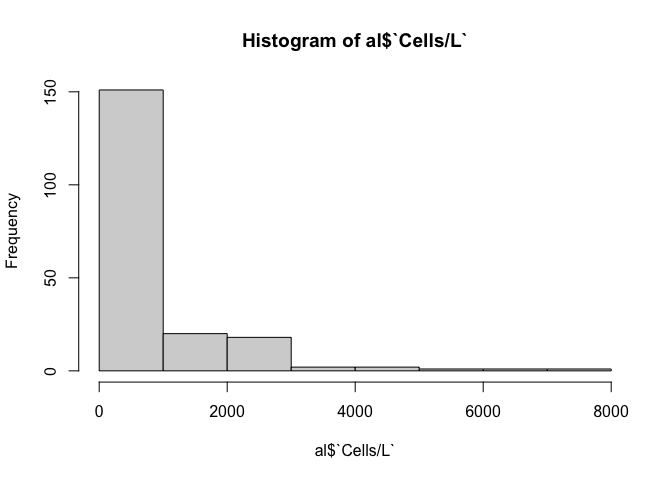<!-- -->

The breaks argument lets us specify number of breaks in the plot

``` r
hist(al$`Cells/L`, breaks=25)
```

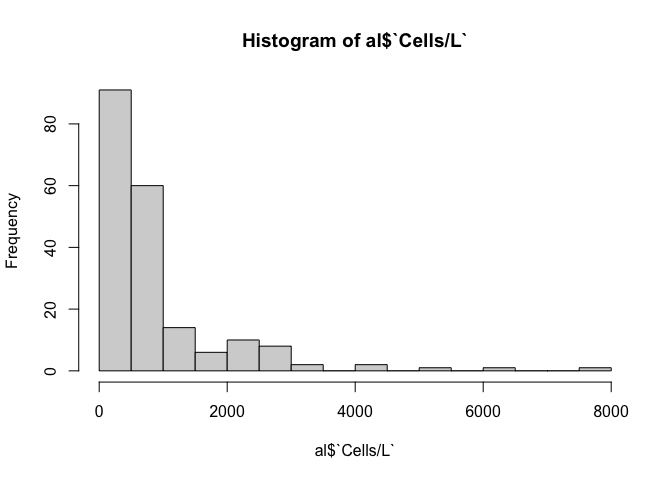<!-- -->

Log-scaled histogram

``` r
hist(log10(al$`Cells/L`+1))
```

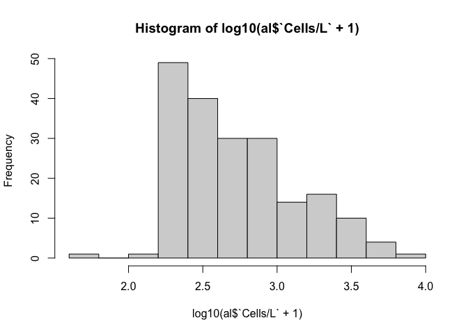<!-- -->

The `plot()` function can be used for simple plotting of two variables

``` r
plot(`Cells/L`~month, data=al)
```

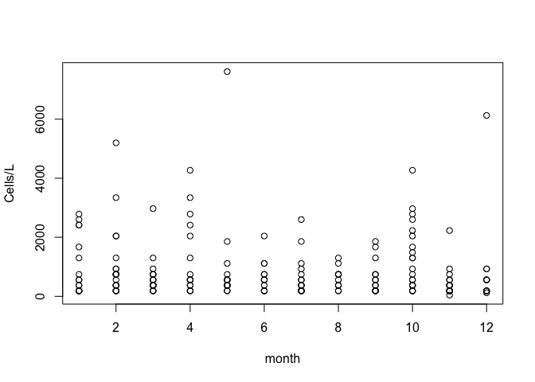<!-- -->

## Plotting with `ggplot2`

We can make plots by creating a plot object with `ggplot()`, then use
the `+` operator to add features to it

Here’s the same plot as above but made with `ggplot2`

``` r
ggplot(data=al, aes(x=month, y=`Cells/L`)) +
  geom_point(alpha=0.3)
```

    ## Warning: Removed 1 row containing missing values or values outside the scale range
    ## (`geom_point()`).

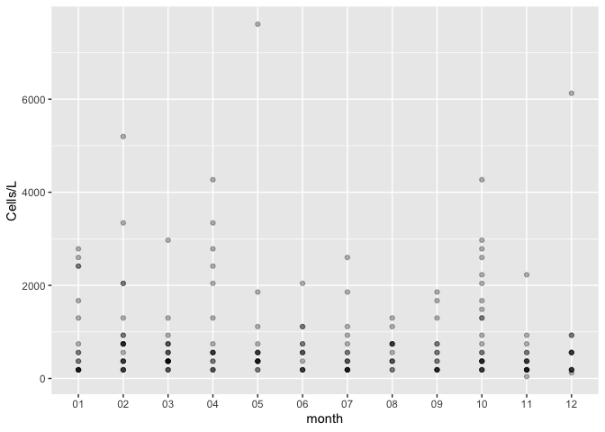<!-- -->

We can make a subset table of the data to use in plots that focus on
more specific data

``` r
y <- al |>
  filter(year == 2019,
         Station == "Production Area 2")

y
```

    ## # A tibble: 19 × 12
    ##    `Date Collected`    Station           Depth     Specie    `Microscope fields`
    ##    <dttm>              <chr>             <chr>     <chr>                   <dbl>
    ##  1 2019-11-25 00:00:00 Production Area 2 composite Alexandr…                   2
    ##  2 2019-11-18 00:00:00 Production Area 2 composite Alexandr…                   2
    ##  3 2019-11-05 00:00:00 Production Area 2 composite Alexandr…                   2
    ##  4 2019-11-05 00:00:00 Production Area 2 composite Alexandr…                   2
    ##  5 2019-10-07 00:00:00 Production Area 2 composite Alexandr…                   2
    ##  6 2019-09-02 00:00:00 Production Area 2 composite Alexandr…                   2
    ##  7 2019-07-22 00:00:00 Production Area 2 composite Alexandr…                   2
    ##  8 2019-06-24 00:00:00 Production Area 2 composite Alexandr…                   2
    ##  9 2019-06-17 00:00:00 Production Area 2 composite Alexandr…                   2
    ## 10 2019-06-04 00:00:00 Production Area 2 composite Alexandr…                   2
    ## 11 2019-05-13 00:00:00 Production Area 2 composite Alexandr…                   2
    ## 12 2019-04-29 00:00:00 Production Area 2 composite Alexandr…                   2
    ## 13 2019-04-17 00:00:00 Production Area 2 composite Alexandr…                   2
    ## 14 2019-04-01 00:00:00 Production Area 2 composite Alexandr…                   2
    ## 15 2019-03-18 00:00:00 Production Area 2 composite Alexandr…                   2
    ## 16 2019-03-16 00:00:00 Production Area 2 composite Alexandr…                   2
    ## 17 2019-03-13 00:00:00 Production Area 2 composite Alexandr…                   2
    ## 18 2019-03-04 00:00:00 Production Area 2 composite Alexandr…                   2
    ## 19 2019-01-21 00:00:00 Production Area 2 composite Alexandr…                   2
    ## # ℹ 7 more variables: `SumOfTransect Count` <dbl>, `Cells/L` <dbl>,
    ## #   Groups <chr>, `Toxin producing species` <chr>, month <chr>, week <chr>,
    ## #   year <chr>

Here’s a line plot of *Alexandrium* abundance at one site during one
year

``` r
ggplot(y, aes(x=`Date Collected`, y = `Cells/L`)) +
  geom_line()
```

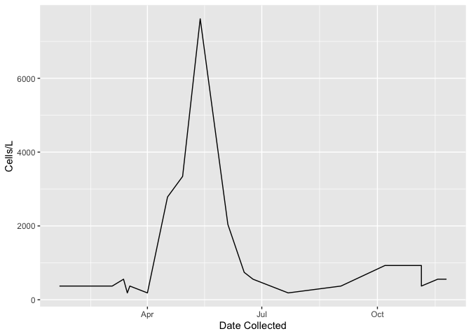<!-- -->

``` r
ggplot(data=al, aes(x=week, y=Station, fill=`Cells/L`)) +
  geom_tile() +
  scale_fill_viridis_b() +
  theme_bw()
```

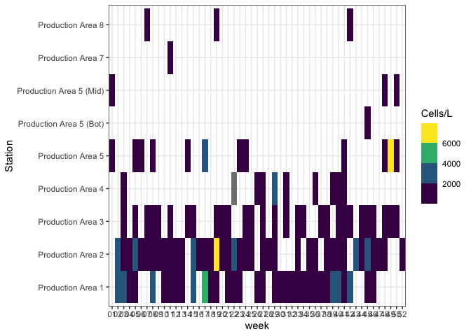<!-- -->

# *Dinophysis* data

``` r
dn <- filter(x, Specie == "Dinophysis acuminata")
```

``` r
dn <- filter(x, Specie %in% c("Dinophysis acuminata", "Dinophysis fortii", "Dinophysis sp.", "Dinophysis rotundata", "Dinophysis accuta"))
```

``` r
count(dn, Station)
```

    ## # A tibble: 10 × 2
    ##    Station                         n
    ##    <chr>                       <int>
    ##  1 Production Area 1             113
    ##  2 Production Area 2             119
    ##  3 Production Area 3              78
    ##  4 Production Area 4              15
    ##  5 Production Area 5              63
    ##  6 Production Area 5 (Bot)         9
    ##  7 Production Area 5 (Mid)        13
    ##  8 Production Area 5 (Surface)     2
    ##  9 Production Area 7               3
    ## 10 Production Area 8              13

``` r
hist(dn$`Cells/L`)
```

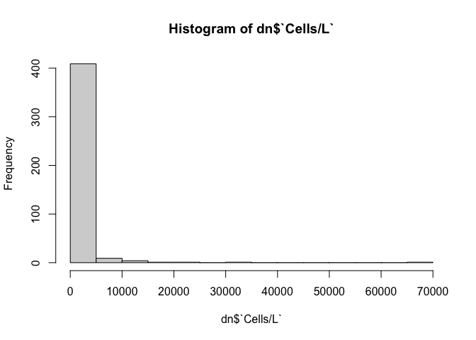<!-- -->

``` r
hist(log10(dn$`Cells/L`))
```

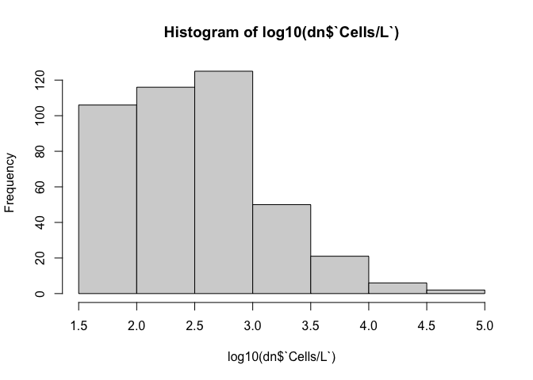<!-- -->

``` r
plot(`Cells/L`~month, data=dn)
```

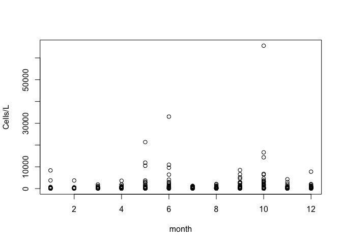<!-- -->

``` r
ggplot(data=dn, aes(x=week, y=Station, fill=`Cells/L`)) +
  geom_tile() +
  scale_fill_viridis_b() +
  theme_bw()
```

<!-- -->

# *Pseudo-nitzschia* data

``` r
pn <- filter(x, Specie %in% c("Pseudo-nitzschia sp.", "Pseudo-nitzschia spp.", "Pseudo-nitzschia seriata gr.", "Pseudo-nitzschia delicatissima gr."))
```

``` r
plot(`Cells/L`~month, data=pn)
```

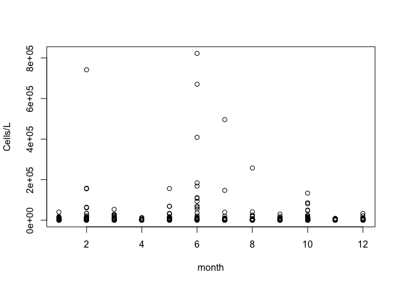<!-- -->

``` r
ggplot(data=pn, aes(x=`Date Collected`, y=Station, fill=`Cells/L`)) +
  geom_tile() +
  scale_fill_viridis_b() +
  theme_bw()
```

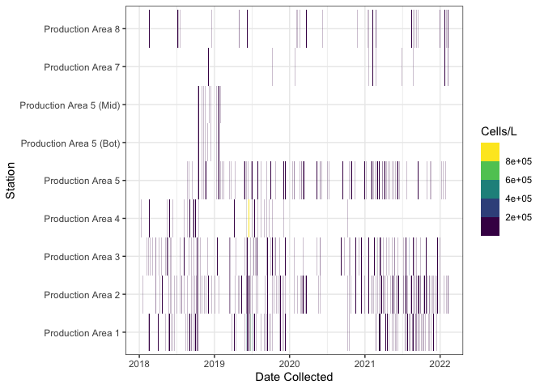<!-- -->

``` r
x |>
  filter(`Toxin producing species` %in% c("PSP", "ASP", "DSP")) |>
  ggplot(aes(x=week, y=Station, fill=`Toxin producing species`)) +
  geom_tile()
```

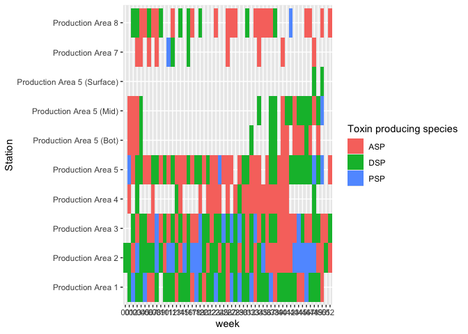<!-- -->
